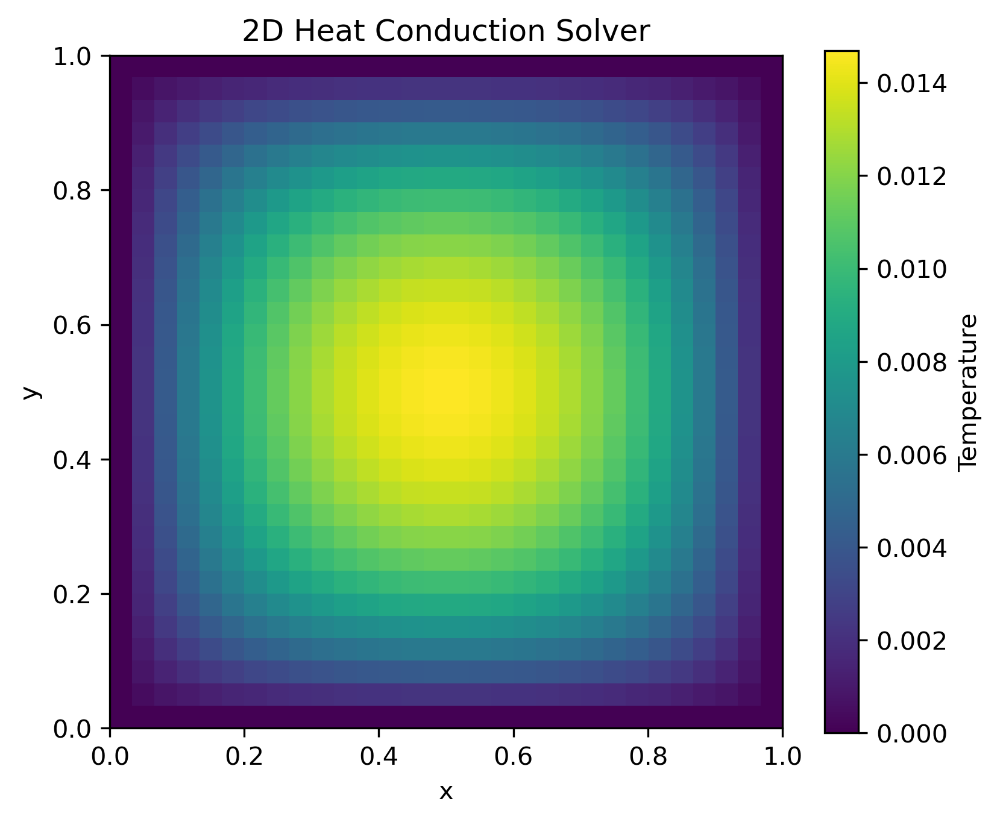
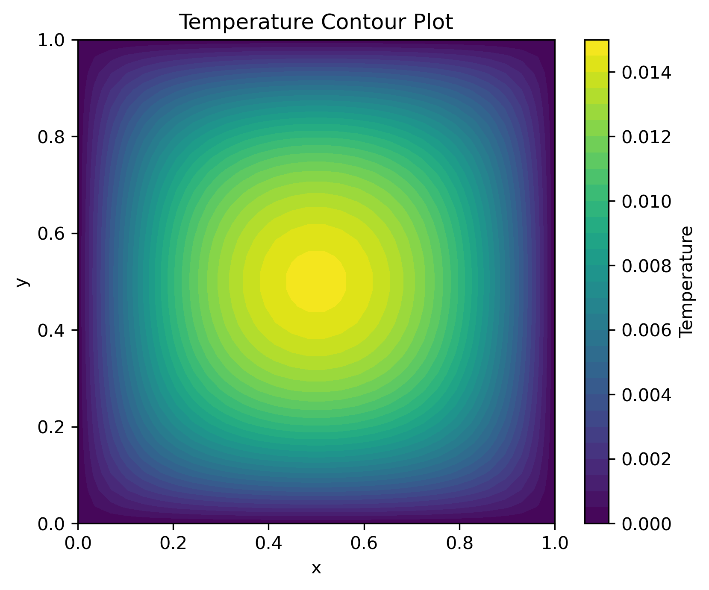
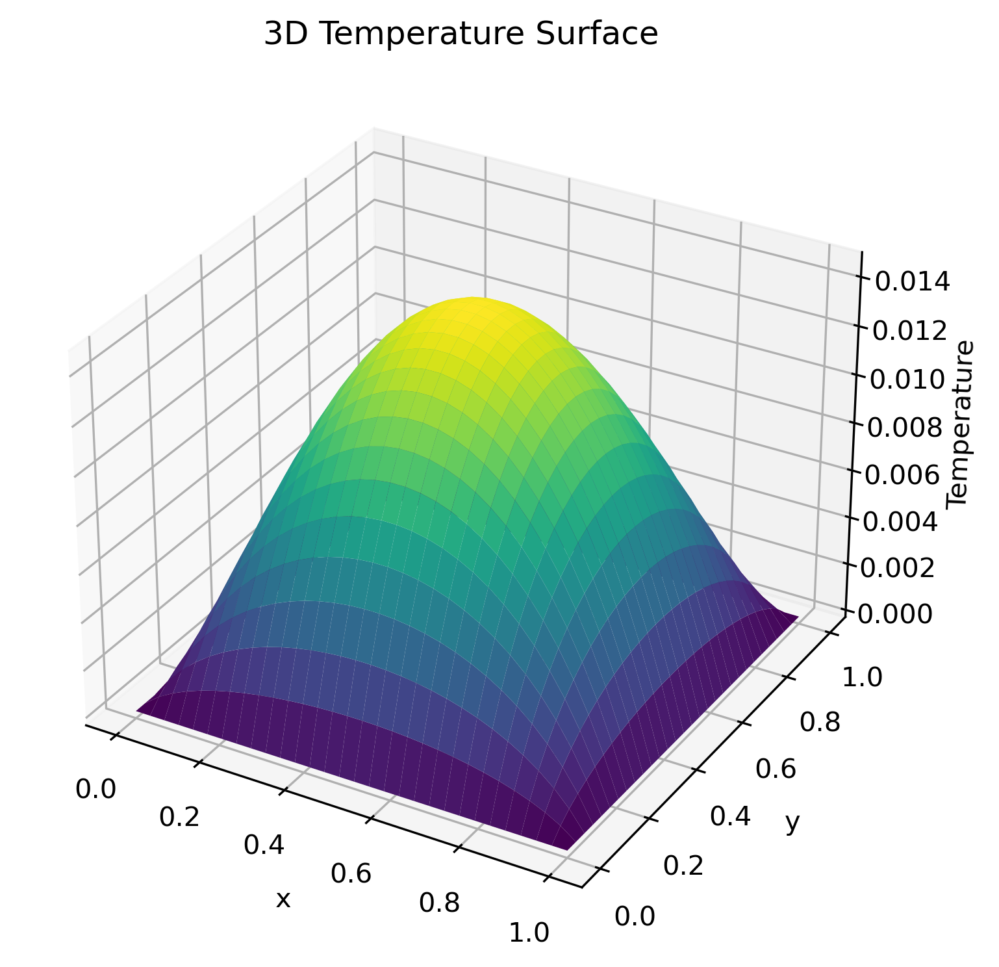
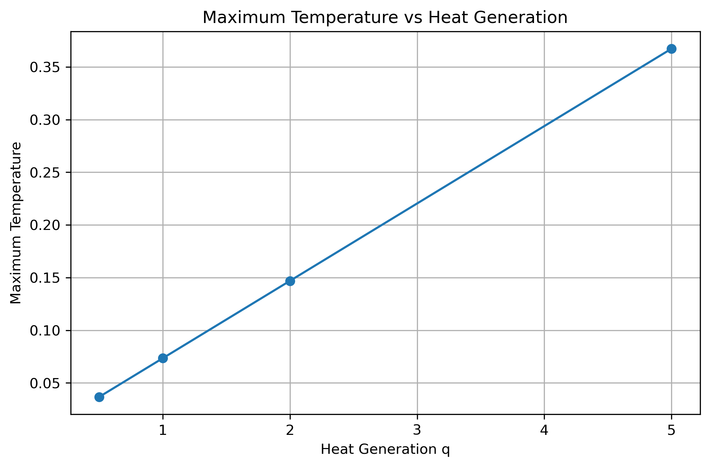
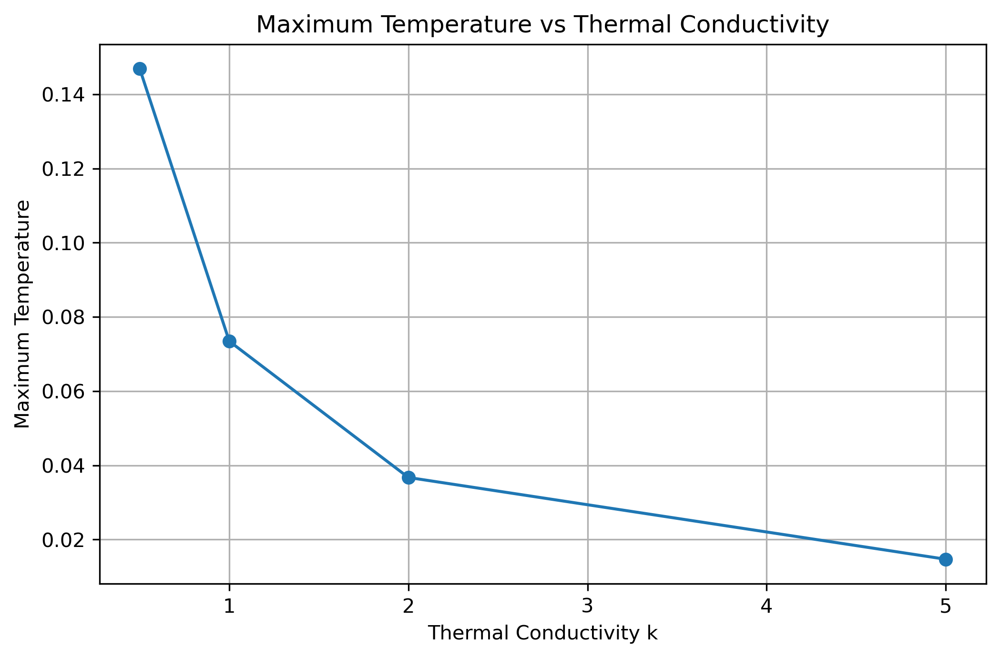
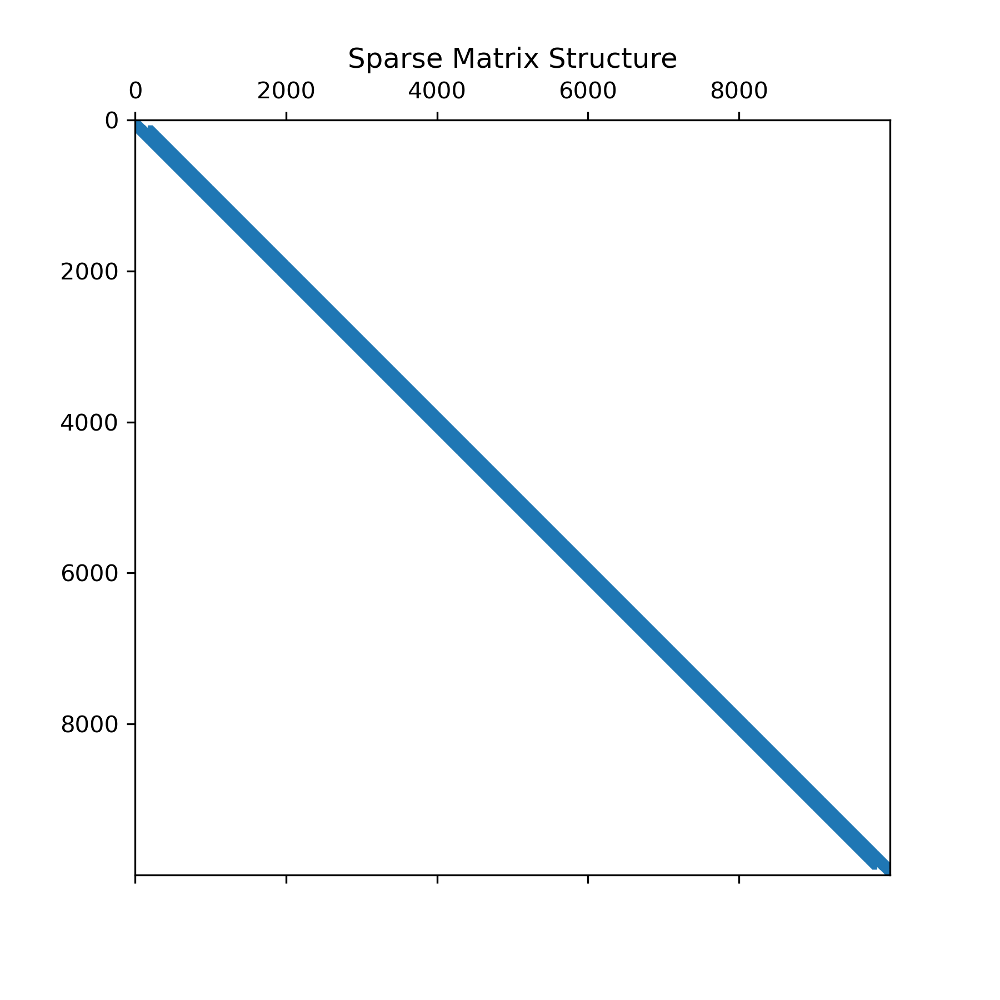
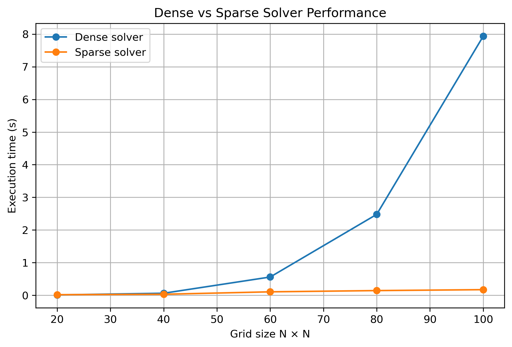

# 2D Heat Conduction Solver

## Overview

This project implements a two-dimensional steady-state heat conduction solver using the Finite Difference Method (FDM).

The solver computes the temperature distribution in a square plate with internal heat generation and configurable boundary conditions.

Both dense and sparse matrix implementations are included, allowing efficient solutions for large computational grids.

---

# Governing Equation

The steady-state heat conduction equation with uniform volumetric heat generation is

\[
\frac{\partial^2T}{\partial x^2}
+ 
\frac{\partial^2T}{\partial y^2}
=
-\frac{q'''}{k}
\]

where

- \(T\) = temperature
- \(q'''\) = volumetric heat generation
- \(k\) = thermal conductivity

---

# Numerical Method

The computational domain is discretized using a uniform Cartesian grid.

Applying second-order central finite differences results in the five-point stencil

\[
T_{i+1,j}
+
T_{i-1,j}
+
T_{i,j+1}
+
T_{i,j-1}
- 
4T_{i,j}
=
-\frac{q'''}{k}\Delta x^2
\]

The discretized equations are assembled into the linear system

\[
AT=b
\]

which is solved using both dense and sparse linear algebra techniques.

---

# Index Mapping

The two-dimensional computational grid is transformed into a one-dimensional vector using

\[
p=iN_y+j
\]

allowing the finite difference equations to be assembled into a matrix system.

---

# Boundary Conditions

The solver supports configurable boundary conditions through a dictionary-based interface.

Current implementation:

- Dirichlet boundary conditions

The code structure is prepared for future implementation of:

- Neumann boundary conditions
- Robin (convective) boundary conditions

---

# Matrix Assembly

Each interior node is connected only to its four neighboring nodes, producing the classical five-point finite difference stencil.

The resulting coefficient matrix is sparse.

---

# Temperature Distribution

## Heat Map

---

## Contour Plot

---

## Surface Plot

---

# Parametric Studies

## Effect of Heat Generation

Increasing the volumetric heat generation increases the maximum plate temperature approximately linearly.

---

## Effect of Thermal Conductivity

Higher thermal conductivity improves heat diffusion, reducing the maximum temperature inside the plate.

---

# Sparse Matrix Implementation

The coefficient matrix contains only five non-zero coefficients per interior node.

Instead of storing every matrix element, the solver uses SciPy sparse matrices.

Assembly:

- `lil_matrix`

Solution:

- `csr_matrix`
- `spsolve`

---

## Sparse Matrix Structure

The sparse storage format drastically reduces memory consumption while maintaining the same numerical solution.

---

## Dense vs Sparse Solver

Both implementations produce identical temperature fields.

The sparse implementation becomes increasingly advantageous as the computational mesh grows.

---

# Engineering Relevance

Finite difference heat conduction solvers are widely used in engineering applications including

- Nuclear fuel analysis
- Heat exchanger design
- Thermal management
- Electronic cooling
- Mechanical component design
- Computational heat transfer

The sparse implementation represents the standard approach used in large-scale scientific computing.

---

# Skills Demonstrated

- Finite Difference Method (2D)
- Elliptic Partial Differential Equations
- Matrix Assembly
- Sparse Linear Algebra
- Scientific Computing
- Numerical Heat Transfer
- Parametric Analysis
- Data Visualization
- Python
- NumPy
- SciPy
- Matplotlib

---

# Future Improvements

Potential extensions include

- Neumann boundary conditions
- Robin boundary conditions
- Non-uniform meshes
- Spatially varying thermal conductivity
- Transient heat conduction
- Finite Volume Method
- Parallel sparse solvers
- GPU acceleration

---

# Tools

- Python
- NumPy
- SciPy
- Matplotlib
